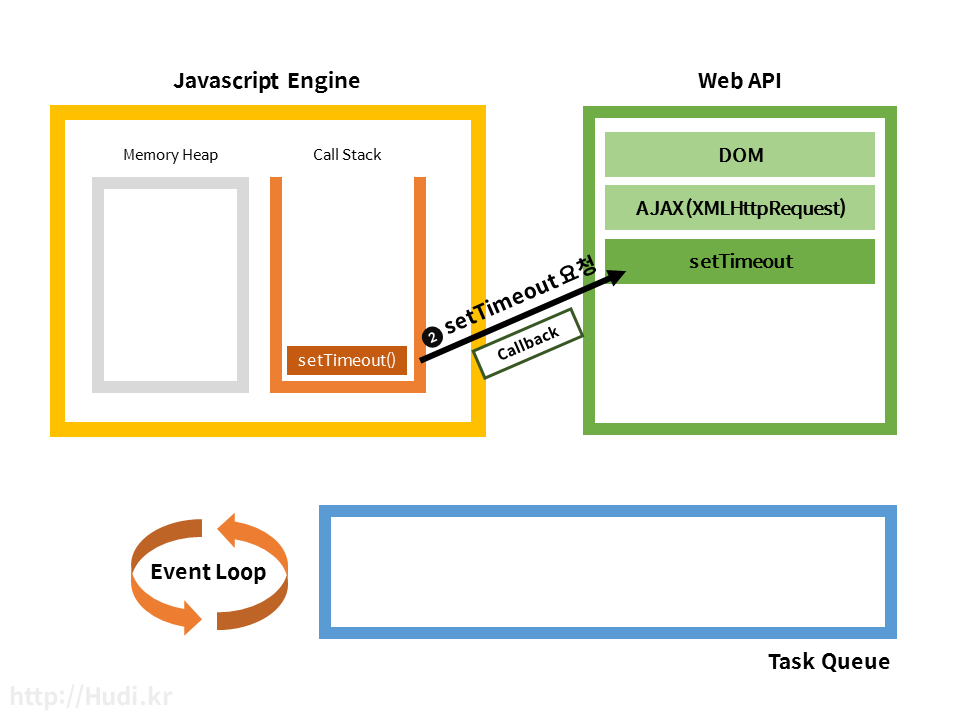

# How it Works? 

## 개요
Javascript를 공부하면서, 콜백함수의 동작방식이, 즉 비동기 동작은 나에게 'single thread 기반이라며... multi thread 인것 같은데..' 하는 끝없는 의문점이 생기는 부분이었다.  

결론적으로, `JavaScript는 single thread가 맞고, 단지 일을 여러명이서 해서 multi 가 아닐까 하는 착각이 들도록 하는 것이었다.`  

여러 블로그들을 참고하고 질문을 통해 얻은 점들을 정리해보자.  

## JavaScript Engine

자바스크립트 엔진의 대표적인 예는 Google V8 엔진입니다. V8 은 Chrome과 Node.js에서 사용한다. 아래는 엔진의 구조도를 간단히 나타낸 그림이다.


엔진의 두 주요 구성요소는
* Memory Heap : 메모리 할당이 일어나는 곳
* Call Stack : 코드 실행에 따라 호출 스택이 쌓이는 곳

자바스크립트 엔진은 메모리 힙과 단일 호출 스택 (Call Stack)을 가지고 있다. 하나의 호출 스택만 가지고 있으므로 위에서 지겹게 언급했듯이, 한번에 단 하나의 함수만 처리할 수 있다. 다음과 같은 시시콜콜한 자바스크립트 코드를 실행해보자.

```javascript
function a() {
    b()
    console.log("a")
}

function b() {
    console.log("b")
}

a()
```

결과가 어떻게 나오는가? 당연히 “b”, “a” 순서대로 출력되는 것이 정상이다. 왜 이런 순서로 출력되는지 Call Stack 에 함수가 쌓이는 순서를 보고 확인해보자.


보이는 것 같이 스택의 형태로 호출된 함수를 추가하고 (Push) 실행된 함수를 제거 (Pop) 하는 형태이다.  이렇게 자바스크립트는 다른 함수가 실행되고 있을때는 그 함수가 종료되기 직전까지 다른 작업이 중간에 끼어들 수 없다. 이것을 `Run-to-completion 이라고 한다.` 내가 제일 헷갈렸던 부분이다. 
 ~~뭐야, 그럼 결국 동시실행이 불가능하다는 이야기잖아.~~  
 하지만, **자바스크립트는 자바스크립트 엔진으로만 돌아가는 것이 아니다.**

## Javascript Runtime


사실 자바스크립트 엔진 밖에서도 자바스크립트 실행에 관여하는 요소들이 존재한다. 각각 Web API와 Task Queue, Event Loop 이다. 비동기 작업시 각 요소의 역할에 대해 알아보자.  
(얘네 덕에 처음에 언급한 `마치 멀티스레드 같은` 느낌이 났다. )  

### Web API

위 사진과 같이, Web API 는 브라우저에서 제공되는 API이며, `AJAX` 나 `Timeout` 등의 비동기 작업을 실행한다. 자바스크립트에서 setTimeout 과 같은 함수를 실행하면, 자바스크립트 엔진은 Web API에 setTimeout 을 요청하고 동시에 setTimeout에 넣어준 Callback 까지 전달한다. Callstack 에서는 Web API 요청 이후 setTimeout 작업이 완료되어 제거된다.

Web API는 방금 요청받은 setTimeout을 완료하고, 동시에 전달받은 Callback 을 Task Queue라는 곳에 넘겨준다. 다음으로 Task Queue와 Event Loop 에 대해 알아보자.

요약 : 
1. CallStack에서는 Web API에 `Web API가 할일` 만 토스한다.  
2. Web API는 요청받은 setTimeout을 수행하고, Callback을 Task Queue에 넣는다. 

### Task Queue와 Event Loop

Task Queue 는 Callback Queue 라고도 하는데, 큐 형태로 Web API에서 넘겨받은 Callback 함수를 저장한다.  
이 Callback 함수들은 자바스크립트 엔진의 Call Stack의 모든 작업이 완료되면 순서대로 Call Stack에 추가된다. 이 때 `Call Stack 가 비어있지 않은지` (실행중인 작업이 존재하는지) 와 `Task Queue 에 Task가 존재하는지` 를 판단하고, Task Queue 의 작업을 Call Stack 에 옮기는 일을 Event Loop가 작업한다.  Event Loop 는 이 작업을 처음부터 끝까지 계속 반복하여 실행한다. 그래서 Event ‘Loop’ 인것이다.  
  
요약 :
1. 콜백 큐가 Web API에서 받은 Callback 함수를 저장
2. 이벤트 루프가 Call Stack이 한가할 때 콜백큐의 작업을 콜스택으로 올려줌. 

### 직접 해보자.

```javascript
setTimeout(function() {
    console.log("All task was done.");
}, 5000);
```

위 코드는 5초뒤에 문장을 출력하는 아주 간단한 코드이다. 어떻게 비동기로 작동하는지 알아보자.  

1. 코드가 실행되고 setTimeout 함수가 실행되면서 Call Stack 에는 setTimeout 함수가 추가된다.


2. setTimeout 함수는 자바스크립트 엔진이 처리하지 않고, Web API가 처리하기에 setTimeout 에 담긴 Callback 함수를 전달함과 동시에 setTimeout 작업을 요청한다.


3. Call Stack 에서는 모든 작업이 완료되었으므로 setTimeout 작업이 제거된다. 
4. Web API는 setTimeout 작업이 실행된다. 5000ms 를 기다린다.


5. 5000ms 가 지나고, Task Queue로 Callback 함수를 전달한다.


6. Event Loop는 항상 Call Stack이 비어있는지, Task Queue 에 작업이 있는지 검사하고 있는데, 마침 지금은 Call Stack이 비어있고, Task Queue 에 수행할 작업이 추가되어 있다. 


7. Task Queue에서 대기하던 Callback 함수 하나를 Call Stack 으로 보낸다.


8. Callback 함수의 작업도 전부 완료되어 Pop되고, 프로그램이 종료된 모습이다.


### Interval이 0이라면?

```Javascript
setTimeout(function() {
    console.log("Bye, World!");
}, 0);
console.log("Hello, World!")
```

보통 이런 케이스가 생각의 오류가 일어날 수 있는 케이스다. 
결론적으로, 결과는
```
Hello, World!
Bye, World!
```

#### 설명
인터벌이 0이라고 해서 크게 다른게 아니다.  
1. setTimeout이 가장 먼저 CallStack에 들어간다.
2. Call Stack은 자기일이 아니므로 Web API에 작업을 요청하고 Call Stack에서 삭제한다.
3. 동시에 Call Stack 에 `console.log("Hello, World!")` 가 등록된다.  
4. `console.log("Hello, World!")` 가 완료되고 Call Stack에서 제거된다. 
5. Task Queue에서 대기중이던 `console.log("Bye, World!")` 가 Call Stack으로 올라온다. 
6. 실행되고 종료된다. 
(`올라온다` 라는 표현은 그냥 설명의 편의를 위해서 사용한 표현 )  

### Ajax 요청이 여러개라면 ? 
이 부분은 내가 헷갈렸던 부분이다.  
`페이스북에, 구글에, 깃헙에 동시에 ajax 요청을 날리면 그건... ?`  
나는 지식이 부족해서 착각했던 부분이다.  

Ajax의 정의 자체를 보고가자. 

```
Ajax : Asynchronos JavaScript And XML
비동기 자바스크립트와 XML을 뜻함

html form을 이용하지 않고 자바스크립트를 통해 서버에 데이터를 요청하는 것

서버 측의 스크립트와 통신하기 위한 XMLHttpRequest 객체를 사용하는 것

순서

1. XHR 객체 생성 : XMLHttpRequest Object 생성

2. callback 생성

3. html 메소드, url 결정 : open a request

4. XHR 메소드로 정보 발송 : send a request

```

클라이언트 > 서버로 요청을 보내놓고 프로그램은 계속 돌아갈 수 있다는 의미이다. 

ajax 요청이 다음과 같은 순서대로 들어왔다고 하자.

```javascript
fetch('https://facebook.com')
....
fetch('https://google.com')
...
fetch('https://github.com')
...
```

Call Stack에는 ajax 요청이 순서대로 쌓이고, Web API는 AJAX 요청을 해당 url로 보낸다. 
**응답이 오는 순서대로 Call bakc Queue** 에 넣는다. 

차례대로 요청은 하지만, 네트워크 속도가 다 다르기때문에 누가 먼저 응답을 줄지는 알 수 없다.  

동시에 요청하는 것은 아니고 차례대로 요청은 하지만, 해당 응답을 동기적으로 기다리지 않는다. 


### 직접 보자!
[http://latentflip.com](http://latentflip.com/loupe/?code=JC5vbignYnV0dG9uJywgJ2NsaWNrJywgZnVuY3Rpb24gb25DbGljaygpIHsKICAgIHNldFRpbWVvdXQoZnVuY3Rpb24gdGltZXIoKSB7CiAgICAgICAgY29uc29sZS5sb2coJ1lvdSBjbGlja2VkIHRoZSBidXR0b24hJyk7ICAgIAogICAgfSwgMjAwMCk7Cn0pOwoKY29uc29sZS5sb2coIkhpISIpOwoKc2V0VGltZW91dChmdW5jdGlvbiB0aW1lb3V0KCkgewogICAgY29uc29sZS5sb2coIkNsaWNrIHRoZSBidXR0b24hIik7Cn0sIDUwMDApOwoKY29uc29sZS5sb2coIldlbGNvbWUgdG8gbG91cGUuIik7!!!PGJ1dHRvbj5DbGljayBtZSE8L2J1dHRvbj4%3D)

여기서 자신의 코드가 각각 콜스택, 이벤트루프, 등등에 어떤 순서로 들어가고 실행되는지 볼 수 있다. 

## 출처
[captain_pangyo_동작원리](https://joshua1988.github.io/web-development/translation/javascript/how-js-works-inside-engine/)
[hudi.kr](https://hudi.kr/%EB%B9%84%EB%8F%99%EA%B8%B0%EC%A0%81-javascript-%EC%8B%B1%EA%B8%80%EC%8A%A4%EB%A0%88%EB%93%9C-%EA%B8%B0%EB%B0%98-js%EC%9D%98-%EB%B9%84%EB%8F%99%EA%B8%B0-%EC%B2%98%EB%A6%AC-%EB%B0%A9%EB%B2%95/)
[vida valiente](http://diaryofgreen.tistory.com/127)
