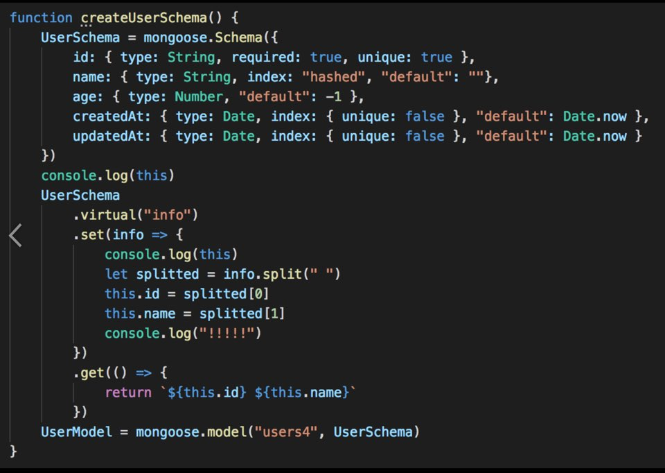

# this 
> ES6, ES5 문법을 적용하다 보니 문법이 헷갈렸고, 애초에 Javascript에서의 this에 대한 이해가 부족했다.  
> 이 문서에서 언급되는 코드는 모두 **브라우저 내에서 실행** 되었다고 가정한다.

[Mozila_this의 이해](https://developer.mozilla.org/ko/docs/Web/JavaScript/Reference/Operators/this)
[Mozila_ArrowFunction](https://developer.mozilla.org/ko/docs/Web/JavaScript/Reference/Functions/애로우_펑션)

## JavaScript에서의 this

JavaScript에서의 this 란 **함수가 호출된 맥락** 이다. 
바꾸어 말하면, **누가 이 함수를 호출한 context** 인가 하는 것이다. 

가령, 아무것도 없는 `index.js` 가 있다고 가정하자. 
```javascript
function foo() {
  console.log('hello world', this)
}

foo();
```

이 경우 this는 window 객체이다. (node.js 에서와는 다름.)
> 추가 설명 : Browser가 window 객체를 생성하고, script Tag를 만나면 index.js 를 로드한다.  
> 이때, 코드를 실행하는 주체가 window 객체이기 때문에 결과 log에는 window 가 나타난다. 

## ES5_this

```javascript
var obj = {
  num: 5,
  foo: function () {
    console.log(this.num)
  }
}
obj.foo()
```
이 코드의 실행 결과는 5이다. 
this = 누가 이 함수를 호출했는가. 이고, 여기선 obj가 foo method를 호출했으므로 this는 obj가 된다. 

```javascript
function Car() {
  this.velocity = 0;

  this.go = function () { 
    this.velocity += 5; 
  }
  this.showVelocity = function {
    console.log(this.velocity)
  }
}
var car = new Car()
car.go()
car.showVelocity()
```

결과는 `5` 

```javascript
function Timer() {
  this.v = 'Hello World';
  
  setTimeout(function () {
    console.log(this.v);
  }, 1000);
}

var timer = new Timer();
```

이 코드의 실행 결과는 `undefined` 이다. setTimeout은 Web API를 호출하고, Queue에 저장했다가 call back 함수를 Call Stack에 넣어 실행하는 구조이다. 
[JS 0_how_it_works](https://github.com/SoYoung210/Study_note/blob/master/Javascript/0_how_it_works.md)

setTimeout 내부의 익명함수는 호출 주체가 global 객체이고, 따라서 `window.v` 를 호출하려고 하지만, 정의하지 않았으므로 undefined 라는 결과이다. 

이제 좀더 어렵고 헷갈리는 코드를 살펴보자.
```javascript
function Car() {
  this.v = 0;
  
  this.go = function () {
    engine();
  }

  this.show = function () {
    console.log(this.v);
  }

  function engine() {
    this.v++;
  }
}

var car = new Car();

car.go();
car.show();
```

여기서 log에 찍히는 값은 무엇일까? 1일까 0일까 아니면 undefined 일까?
우선, 답은 0이다.  

이유는 engine을 호출하는 주체가 window 이기 때문이다.  
이 말을 좀더 풀어서 적어보자. 

1. show를 호출한 주체는 누구? : car
2. go를 호출한 주체는 누구? : car
3. engine을 호출한 주체는 누구? :   

engine앞에 아무것도 없다. global이 실행한것. (window)
this는 window 이고 `this.v++;` 는 `window.v++;` 과 같다. 

`car.show()`가 실행될때 this는 car이고, **car에는 아무 변화가 없으니** 결과적으로 0이 출력된다.  

> 덧붙이자면, 이런 혼란때문에 함수 맨 첫줄에 var self = this; 로 선언하고 이 self를 활용하는 방식의 오픈소스가 많다. 

```javascript
functin example1() {
    var self = this;
    slef.myTest; // 이런 식
}
```

예제 Car 코드에서 1이 나올것으로 기대한 이유가 무엇일까?  
engine 함수가 Car 내부에 있는 함수이고 그 안쪽에서 Car의 변수를 조작하고 있기 때문이다. 

예제를 조금더 살펴보자.

```javascript
var name = 'cookie';

function print() {
  console.log(name);
}

print();
``` 

이 코드의 실행결과는 `cookie` 이다. 
이 코드의 결과를 이해하는 것은 어렵지 않았다. 

그럼 다음 코드를 보자.

```javascript
var name = 'cookie';

function print() {
  console.log(name);
}


function printAnotherName() {
  var name = 'cream';
  print();
}

printAnotherName()
```

자, 이 코드의 실행결과는 무엇일까? 
~~저번엔 cookie 였으니까 이번엔 cream일거란 추측은....~~ 
`cookie`이다. 

printAnotherName에서 print를 호출했고, print 위치에서 name을 찾는 과정이 이루어지기 때문이다. 

한개만 더보자. 

```javascript
var name = 'cookie';

function print() {
  console.log(name);
}


function printAnotherName() {
  var name = 'cream';
  print();
  
  function print() {
    console.log(name);
  }
}

printAnotherName();
```

이번엔 cookie 일까 cream일까 ? `cream` 이다. 

cookie & cream 코드는 전부 javascript scope 설명을 위한 코드였다. (!!)

## lexical scope && Closure(조금)
javascript의 function은 lexical scope에 따라 변수를 참조한다. 
대략적으로 설명하자면, lexical scope은 대략 `함수가 선언되어 있는 위치` 정도로 생각해도 ~~어느정도~~ 무방하다.  

```javascript
function foo() {
  var name = 'abc';
  console.log(name);
}
foo()
```

foo 함수가 실행돼서 변수를 찾을 때 과정은 아래와 같다.

```
if(함수안에 선언되어 있는가?) {
    찾았다!
}else {
    if(함수_바깥에서_가장_가까운_해당변수_찾기())
        찾았다!
}
```

```javascript
function foo() {
  var name = 'abc';
  bar();

  function bar() {
    console.log(name);
  }
}

foo();
```
이 코드의 실행결과는 무엇일까? 

foo가 bar를 호출했고, bar 안에서는 name 변수가 필요하다.
bar 바로 바깥 scope에 name 변수가 존재하니, 해당 값을 찾아 출력을 완료한다. 

조금 더 다른 코드를 보자.

```javascript
function foo() {
  var name = 'abc';
  bar();
}

function bar() {
  console.log(name);
}
foo();

```

이제 어느정도 툭툭 답이 나온다. 답은 `undefined` 이다.
foo가 bar를 호출했고, bar는 자신의 내부에 name변수가 없으므로 바깥 scope에서 name을 찾으려고 하지만 name이 없다.
> 혹시 cookie나 cream이 출력되신다면 브라우저를 refresh 후 다시 테스트 해보시길 바랍니다. 

하지만 함수가 선언되어 있는 외부 함수로부터 변수들을 참조해서 쓸 수 있도록 묶어주는 것이 있는데,  
이것이 **클로저(Closure)** 이다. 
> Closure에 관한 자세한 정리는 추후 문서로 업데이트. 

## 헷갈리기 시작하는 this
```javascript
function Car() {
  this.v = 0;
  
  this.go = function () {
    engine();
  }

  this.show = function () {
    console.log(this.v);
  }

  function engine() {
    this.v++;
  }
}

var car = new Car();

car.go();
car.show();
```

클로저까지 잘 따라오고 나면, 여기서 다시 오해를 하게 된다. 
> `engine` 함수 내부에 this..가뭐지.. 그럼 바깥으로 가볼까.. 아 뭐 바깥은 Car이겟거니.. 

하는 오류 말이다. 

1. context는 함수를 호출하는 대상에 따라서 지정된다.
2. Closure는 함수 안에 변수가 선언되어 있지 않으면 함수 바깥의 변수를 참조한다.

이 두가지 때문에 사람들은 function 생성자 안에서 this를 클래스의 인스턴스를 참조하는데만 쓰고 싶어한다.
(일반적으로 Java의 OOP 에서 쓰듯. )

그래서 open source 에는 `var self = this` 같은 코드가 넘치게 된다. 

결국 ECMAScript를 개정하면서 `arrow function` 안의 `this` 는 무조건 **lexical context** 라고 지정해버렸다. 

## 변화된 this
```javascript
//ES5
function Car() {
  this.v = 0;
  
  this.go = function () {
    engine();
  }

  this.show = function () {
    console.log(this.v);
  }
  
  var engine = () => {
   this.v++;
  }
}

var car = new Car();

car.go();
car.show();
```

```javascript
//ES6
function Car() {
  this.v = 0;
  
  this.go = () => {
    engine();
  }

  this.show = () => {
    console.log(this.v);
  }
  
  var engine = () => {
   this.v++;
  }
}

var car = new Car();

car.go();
car.show();
```

결론만 말하면, 새로고친 ES6버전의 코드에서는 1이 출력된다. (오잉..) 

engine이라는 변수에 익명함수를 집어넣는데, 이 함수 안에서 호출되는 this는 누가 부르는지는 중요하지 않고, **이 함수가 선언된 위치** 즉, `lexical` 이 중요하다. 

이 함수가 `function Car` 생성자 안에 선언되어 있으니, 
`() => {this.v++}` 가 선언된 위치의 this가 이 함수가 호출될 때의 this이다. 

다시한번 정리해서 말하자면, `() => {this.v++}` this는 함수가 선언된 위치의 바깥에 있는 this를 참고한다. (아까 cookie & cream 예제처럼 )  

## 내가 헷갈려서 하는 정리. 


이 코드에서 set, get 부분을 function 형태로 코딩하면 정상작동하지만  
arrow function 으로 구현시 id값이 할당되지 않아 오류를 뱉는 상황에서부터 this에 대한 고민이 시작되었다.  

이제 이 코드로 정리해보자.  

여기서 필요없는 다른 부분은 걷어내고, `this` 에 Focusing 해보자.

```javascript
function createUserSchema() {
  // ….
  const set = (info) => {
    console.log(this);
    // …
  }
  set();

  // …
}

createUserSchema();
```

UserSchema.set이라는 함수에 파라미터로 `info=>{...}` 이라는 함수를 전달했다. 

이때 this는 `lexical context` 규칙을 따르고, 이 규칙을 적용하면 이 익명 arrow function이 선언된 바깥의 this를 계승받는다. 

createUserSchema 호출 위치가 global이니, this는 global을 계승받는다. (node일 경우 node global)

그래서 this는 알겠고. 에러는 왜 나는걸까. 

### context 우선순위 
```javascript
var obj = { v: 5 };

function foo() {
  console.log(this.v);
}

foo();
```

이건 그냥 슬쩍봐도 undefined이다.   

```javascript
var obj = { v: 5 };

function foo() {
  console.log(this.v);
}

foo.call(obj)
```

이건 자세히 보니 5이다. 
똑같이 foo를 호출하는데 foo 가 호출되었을 때 callapthemfh context인자를 넘기는 방식이다. 

이건 callback에서 많이 사용한다. 
callback은 비동기이고, 그러다보니 (아니다 예제 코드를 보자.)

```javascript
function Car () {
  this.name = 'Ferrari';

  setTimeout(shout, 1000);
}

function shout() {
  console.log(this.name);
}

var car = new Car();
```

1초후에 undefined를 외친다. (엉엉)
나중에 shout가 어디서 callback으로 호출되던간에, 그 호출되던 당시의 객체 이름을 불러주면 좋겠다. (페라리를 외쳐줘) 

```javascript
//ES5
function Car () {
  this.name = 'Ferrari';

  var self = this;

  setTimeout(function () {
    shout.call(self);
  }, 1000);
}

function shout() {
  console.log(this.name);
}

var car = new Car();
```

Ferrari!!

이제 다시 arrow function으로 돌아가서,
`.set(info => { })` 에서 arrow function 사용시 call, aply 같이 context를 주입해서 호출하는 함수가 사용되면 주입된 context는 무시되고 lexical context가 우선적용된다. 

this가 정해지는 우선순위는 아래와 같다. 

1. arrow function의 lexical context
2. call, apply 로 외부에서 주입된 경우 
3. 함수를 호출한 주체

결론적으로 this는 내 생각과 다른 this였고,

```javascript
var data = { id: null, name: null };

function get(cb) {
  if (validate(data)) {
    cb.call(data);
  }
}
```
UserSchema의 id에 값이 저장되지 않아서 이런식의 구성인 get에서 error 를 throw하게 된다. 

------------------
Thx To, @pillarlee16

